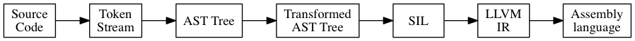

# SIL 介绍
要说SIL，首先得简单说一下Swift编译器的工作流程：

在Transformed AST Tree到最终的机器码之间，还存在两个阶段，分别是SIL和LLVM IR，关于SIL苹果并没有发布任何官方资料，网上零星存在网友们自己写的，即不全也不详细。
SIL 是Swift Intermediate Language缩写，即Swift编译器采用的中间语言，Swift并没有直接使用LLVM IR来当中间语言是因为这个语言提供了很多抽象层次比较高的语法糖，直接使用LLVM IR来描述即啰嗦又不方便，所以就在AST和IR之间加了一个抽象层次，比IR高级但是比AST低级。在JVM/CLR中也提供了Bytecode和MSIL这两种高级虚拟机指令集，SIL和他们类似，但是SIL和他们不一样的是并没有将内存管理给集成到VM内，对象的ARC操作还是需要显式的SIL指令来完成，这为以后SIL升级支持别的内存管理机制提供了可能。


## SIL 长什么样子？
在安装了Xcode的系统里可以使用xcrun swiftc -emit-sil 来查看编译器生成的SIL，比如以下代码：
```
let a = 1;
let b = 2;
println("result=\(a + b)");
```
保存为 test.swift
执行命令 `xcrun swiftc -emit-sil test.swift`，可以得到一大串SIL代码，这里把生成的SIL代码分阶段分析，首先看第一行：
```
sil_stage raw
```
sil_stage 这里目前我发现的有两种取值，`raw`和`canonical`， 分别是 `-emit-sil` 和 `-emit-silgen` 两个参数生成的，这两个参数我对比了一下生成的SIL， canonical 模式下会将其他模块里引用到的符号的完整定义给输出出来，外部链接的除外，而raw生成的对其他模块的引用全部是做的外部链接。


接下来是一组import语句：

```
import Builtin
import Swift
import SwiftShims
```

Builtin模块提供基本类型，这里说的『基本类型』是指的比Int还要基本的类型，Swift比较有意思的一点是所有别的语言中的基本类型和基本运算比如整数和加减法，都是由标准库提供的。你如果定义一个Int类型，实际上是相当于构造了一个标准库里定义的struct，然后传递进去的参数用来初始化这个struct，这个做法就方便的从库层面上解决了字面量到不同类型的转换，而通常这种情况在别的语言里都是由编译器和语言本身提供的，这其实是个很强大的特性，他能通过库来提供基本的这些实现，意味着用户也可以做出和Int类型一样基础的扩展。不过话说回来，如果Int是构造了struct实现的，那么Int的构造函数传递的是什么呢，这里编译器玩了一个巧，给字面量赋予了一个特殊的类型，这个特殊的类型就在Builtin模块内，这个模块本身可能根本就不存在，是语言的设计者为了让语言和标准库的定义变得完备而虚拟出来的，所以这个模块你在Swift源码级别上是无法import的，只能在SIL里import。
Swift模块就是Swift的标准库模块了，基本类型比如Int/String/Bool，基本运算比如加减陈楚，语法糖用到的类型比如Optional/ImplicitlyUnwrappedOptional等都是在这个模块里定义到的，编译器和这个模块有一定程度的耦合。
SwiftShims 模块不太清楚，感觉是部分运行时的支持模块。


```
// test.a : Swift.Int
sil_global @_Tv4test1aSi : $Int
// test.b : Swift.Int
sil_global @_Tv4test1bSi : $Int
```
这里定义了两个全局变量，即前面代码里提到的a和b


```
// top_level_code
sil private @top_level_code : $@thin () -> () {
bb0:
  %0 = sil_global_addr @_Tv4test1aSi : $*Int      // users: %5, %28
  // function_ref Swift.Int.init (Swift.Int.Type)(_builtinIntegerLiteral : Builtin.Int2048) -> Swift.Int
  %1 = function_ref @_TFSiCfMSiFT22_builtinIntegerLiteralBi2048__Si : $@thin (Builtin.Int2048, @thin Int.Type) -> Int // user: %4
  %2 = metatype $@thin Int.Type                   // user: %4
  %3 = integer_literal $Builtin.Int2048, 1        // user: %4
  %4 = apply [transparent] %1(%3, %2) : $@thin (Builtin.Int2048, @thin Int.Type) -> Int // user: %5
  store %4 to %0 : $*Int                          // id: %5
  %6 = sil_global_addr @_Tv4test1bSi : $*Int      // users: %11, %29
  // function_ref Swift.Int.init (Swift.Int.Type)(_builtinIntegerLiteral : Builtin.Int2048) -> Swift.Int
  %7 = function_ref @_TFSiCfMSiFT22_builtinIntegerLiteralBi2048__Si : $@thin (Builtin.Int2048, @thin Int.Type) -> Int // user: %10
  %8 = metatype $@thin Int.Type                   // user: %10
  %9 = integer_literal $Builtin.Int2048, 2        // user: %10
  %10 = apply [transparent] %7(%9, %8) : $@thin (Builtin.Int2048, @thin Int.Type) -> Int // user: %11
  store %10 to %6 : $*Int                         // id: %11
  // function_ref Swift.println <A>(A) -> ()
  %12 = function_ref @_TFSs7printlnU__FQ_T_ : $@thin <τ_0_0> (@in τ_0_0) -> () // user: %44
  %13 = alloc_stack $String                       // users: %43, %44, %45
  // function_ref Swift.String.convertFromStringInterpolation (Swift.String.Type)(Swift.Array<Swift.String>...) -> Swift.String
  %14 = function_ref @_TFSS30convertFromStringInterpolationfMSSFtGSaSS__SS : $@thin (@owned Array<String>, @thin String.Type) -> @owned String // user: %42
  %15 = metatype $@thin String.Type               // user: %42
  // function_ref Swift.String.convertFromStringInterpolationSegment (Swift.String.Type)(Swift.String) -> Swift.String
  %16 = function_ref @_TFSS37convertFromStringInterpolationSegmentfMSSFSSSS : $@thin (@owned String, @thin String.Type) -> @owned String // user: %24
  %17 = metatype $@thin String.Type               // user: %24
  // function_ref Swift.String.init (Swift.String.Type)(_builtinStringLiteral : Builtin.RawPointer, byteSize : Builtin.Word, isASCII : Builtin.Int1) -> Swift.String
  %18 = function_ref @_TFSSCfMSSFT21_builtinStringLiteralBp8byteSizeBw7isASCIIBi1__SS : $@thin (Builtin.RawPointer, Builtin.Word, Builtin.Int1, @thin String.Type) -> @owned String // user: %23
  %19 = metatype $@thin String.Type               // user: %23
  %20 = string_literal utf8 "result="             // user: %23
  %21 = integer_literal $Builtin.Word, 7          // user: %23
  %22 = integer_literal $Builtin.Int1, -1         // user: %23
  %23 = apply %18(%20, %21, %22, %19) : $@thin (Builtin.RawPointer, Builtin.Word, Builtin.Int1, @thin String.Type) -> @owned String // user: %24
  %24 = apply %16(%23, %17) : $@thin (@owned String, @thin String.Type) -> @owned String // user: %34
  // function_ref Swift.String.convertFromStringInterpolationSegment (Swift.String.Type)(Swift.Int) -> Swift.String
  %25 = function_ref @_TFSS37convertFromStringInterpolationSegmentfMSSFSiSS : $@thin (Int, @thin String.Type) -> @owned String // user: %31
  %26 = metatype $@thin String.Type               // user: %31
  // function_ref Swift.+ infix (Swift.Int, Swift.Int) -> Swift.Int
  %27 = function_ref @_TFSsoi1pFTSiSi_Si : $@thin (Int, Int) -> Int // user: %30
  %28 = load %0 : $*Int                           // user: %30
  %29 = load %6 : $*Int                           // user: %30
  %30 = apply [transparent] %27(%28, %29) : $@thin (Int, Int) -> Int // user: %31
  %31 = apply %25(%30, %26) : $@thin (Int, @thin String.Type) -> @owned String // user: %37
  %32 = integer_literal $Builtin.Word, 2          // users: %33#0, %41
  %33 = alloc_array $String, %32 : $Builtin.Word  // users: %34, %36, %38, %41
  store %24 to %33#1 : $*String                   // id: %34
  %35 = integer_literal $Builtin.Word, 1          // user: %36
  %36 = index_addr %33#1 : $*String, %35 : $Builtin.Word // user: %37
  store %31 to %36 : $*String                     // id: %37
  %38 = address_to_pointer %33#1 : $*String to $Builtin.RawPointer // user: %41
  // function_ref Swift.Array.convertFromHeapArray <A>(Swift.Array<A>.Type)(Builtin.RawPointer, owner : Builtin.NativeObject, count : Builtin.Word) -> Swift.Array<A>
  %39 = function_ref @_TFSa20convertFromHeapArrayU__fMGSaQ__FTBp5ownerBo5countBw_GSaQ__ : $@thin <τ_0_0> (Builtin.RawPointer, @owned Builtin.NativeObject, Builtin.Word, @thin Array<τ_0_0>.Type) -> @owned Array<τ_0_0> // user: %41
  %40 = metatype $@thin Array<String>.Type        // user: %41
  %41 = apply %39<String>(%38, %33#0, %32, %40) : $@thin <τ_0_0> (Builtin.RawPointer, @owned Builtin.NativeObject, Builtin.Word, @thin Array<τ_0_0>.Type) -> @owned Array<τ_0_0> // user: %42
  %42 = apply %14(%41, %15) : $@thin (@owned Array<String>, @thin String.Type) -> @owned String // user: %43
  store %42 to %13#1 : $*String                   // id: %43
  %44 = apply %12<String>(%13#1) : $@thin <τ_0_0> (@in τ_0_0) -> ()
  dealloc_stack %13#0 : $*@local_storage String   // id: %45
  %46 = tuple ()                                  // user: %47
  return %46 : $()                                // id: %47
}
```
顶层代码，没有包装在函数内的代码都会顺序执行，相当于有一个虚拟的main函数一样。

```
// Swift.Int.init (Swift.Int.Type)(_builtinIntegerLiteral : Builtin.Int2048) -> Swift.Int
sil [transparent] @_TFSiCfMSiFT22_builtinIntegerLiteralBi2048__Si : $@thin (Builtin.Int2048, @thin Int.Type) -> Int
// Swift.println <A>(A) -> ()
sil @_TFSs7printlnU__FQ_T_ : $@thin <τ_0_0> (@in τ_0_0) -> ()
// Swift.String.convertFromStringInterpolation (Swift.String.Type)(Swift.Array<Swift.String>...) -> Swift.String
sil [readonly] @_TFSS30convertFromStringInterpolationfMSSFtGSaSS__SS : $@thin (@owned Array<String>, @thin String.Type) -> @owned String
// Swift.String.convertFromStringInterpolationSegment (Swift.String.Type)(Swift.String) -> Swift.String
sil @_TFSS37convertFromStringInterpolationSegmentfMSSFSSSS : $@thin (@owned String, @thin String.Type) -> @owned String
// Swift.String.init (Swift.String.Type)(_builtinStringLiteral : Builtin.RawPointer, byteSize : Builtin.Word, isASCII : Builtin.Int1) -> Swift.String
sil [readonly] [semantics "string.makeUTF8"] @_TFSSCfMSSFT21_builtinStringLiteralBp8byteSizeBw7isASCIIBi1__SS : $@thin (Builtin.RawPointer, Builtin.Word, Builtin.Int1, @thin String.Type) -> @owned String
// Swift.String.convertFromStringInterpolationSegment (Swift.String.Type)(Swift.Int) -> Swift.String
sil @_TFSS37convertFromStringInterpolationSegmentfMSSFSiSS : $@thin (Int, @thin String.Type) -> @owned String
// Swift.+ infix (Swift.Int, Swift.Int) -> Swift.Int
sil [transparent] @_TFSsoi1pFTSiSi_Si : $@thin (Int, Int) -> Int
// Swift.Array.convertFromHeapArray <A>(Swift.Array<A>.Type)(Builtin.RawPointer, owner : Builtin.NativeObject, count : Builtin.Word) -> Swift.Array<A>
sil [readonly] @_TFSa20convertFromHeapArrayU__fMGSaQ__FTBp5ownerBo5countBw_GSaQ__ : $@thin <τ_0_0> (Builtin.RawPointer, @owned Builtin.NativeObject, Builtin.Word, @thin Array<τ_0_0>.Type) -> @owned Array<τ_0_0>
```
引用到的其他包内的函数，这里只是做了一个外部引用声明。
